# ERD — Mô hình dữ liệu

**45 bảng**, PostgreSQL. Mọi cột chuỗi có `HasMaxLength` (canh bởi
`MoiEntityPhaiCoConfigTests`); ngoại lệ duy nhất là hai cột JSON của `NHAT_KY_HE_THONG`. Nội dung dưới đây khớp với schema thật (kiểm bằng
`information_schema` sau khi áp toàn bộ migration), không phải bản thiết kế trên giấy.

## Nguyên tắc bắt buộc

> Mọi bảng nghiệp vụ có cột `tenant_id` (FK → `TENANT`) và **bắt buộc** áp dụng EF Core Global
> Query Filter theo `tenant_id` đang đăng nhập. Không được quên ở bất kỳ entity mới nào.
> Cách triển khai: [../backend/multi-tenant.md](../backend/multi-tenant.md).

Áp dụng cho **cả bảng chi tiết** — xem
[Denormalize tenant_id xuống bảng con](#denormalize-tenant_id-xuống-bảng-con).

## Quy ước đặt tên

| Đối tượng | Quy ước | Ví dụ |
|---|---|---|
| Bảng | `UPPER_SNAKE_CASE`, số ít | `LOP_HOC`, `KHOAN_THU_HOC_PHI` |
| Cột | `lower_snake_case` | `giao_vien_chinh_id`, `hoc_phi_ap_dung` |
| Khoá chính | `id` (`uuid`) | |
| Khoá ngoại | `<bảng>_id` | `lop_hoc_id` |
| Index | `ix_<bảng>_<cột>` | `ix_buoi_hoc_lop_hoc_id_thu_tu` |

Sinh tự động bởi `UseSnakeCaseNamingConvention` — xem
[quy-uoc-migration.md](./quy-uoc-migration.md).

## Sơ đồ tổng quan

```mermaid
erDiagram
    TENANT ||--o{ NGUOI_DUNG : "có"
    TENANT ||--o{ TAI_KHOAN : "có"
    TENANT ||--o{ QUYEN : "có"
    TENANT ||--o{ LOP_HOC : "có"
    TENANT ||--o{ TAI_LIEU : "có"

    NGUOI_DUNG ||--o| TAI_KHOAN : "đăng nhập 0..1"
    NGUOI_DUNG ||--o| HO_SO_GIAO_VIEN : "hồ sơ 0..1"
    NGUOI_DUNG ||--o| HO_SO_HOC_VIEN : "hồ sơ 0..1"
    NGUOI_DUNG ||--o| HO_SO_NHAN_VIEN : "hồ sơ 0..1"

    TAI_KHOAN }o--o{ QUYEN : "NGUOIDUNG_QUYEN"
    QUYEN ||--o{ QUYEN_CHUC_NANG : "chi tiết quyền"
    TAI_KHOAN ||--o{ REFRESH_TOKEN : "phiên"
    TAI_KHOAN ||--o{ TOKEN_DATLAI_MATKHAU : "đặt lại mật khẩu"

    LOP_HOC ||--o{ LOP_HOC_HOC_VIEN : "ghi danh"
    LOP_HOC ||--o{ LOP_HOC_TRO_GIANG : "phân công"
    LOP_HOC ||--o{ LOP_HOC_KHOA_HOC : "dạy khoá"
    KHOA_HOC ||--o{ LOP_HOC_KHOA_HOC : "được dạy ở"
    LOP_HOC ||--o{ BUOI_HOC : "lịch học"
    LOP_HOC ||--o{ BAI_KIEM_TRA : "bài kiểm tra"
    LOP_HOC ||--o{ TAI_LIEU_LOP_HOC : "gán tài liệu"
    LOP_HOC ||--o{ KHOAN_THU_HOC_PHI : "sổ thu"
    NGUOI_DUNG ||--o{ LOP_HOC : "dạy chính"

    BUOI_HOC ||--o{ DIEM_DANH : "điểm danh"
    BUOI_HOC ||--o{ NHAN_XET_BUOI_HOC : "học viên nhận xét"
    BUOI_HOC ||--o{ BAI_TAP : "giao bài"
    BAI_TAP ||--o{ BAI_NOP : "nộp nhiều lần"
    BAI_KIEM_TRA ||--o{ BAI_LAM : "bài làm"
    TAI_LIEU ||--o{ TAI_LIEU_LOP_HOC : "gán lớp"

    BAI_TAP ||--o{ TEP_DINH_KEM : "đính kèm"
    BAI_NOP ||--o{ TEP_DINH_KEM : "đính kèm"
    BAI_KIEM_TRA ||--o{ TEP_DINH_KEM : "đính kèm"
    BAI_LAM ||--o{ TEP_DINH_KEM : "đính kèm"
    TAI_LIEU ||--o{ TEP_DINH_KEM : "đính kèm"

    NGUOI_DUNG ||--o{ LOP_HOC_HOC_VIEN : "là học viên"
    NGUOI_DUNG ||--o{ DIEM_DANH : "được điểm danh"
    NGUOI_DUNG ||--o{ NHAN_XET_BUOI_HOC : "viết nhận xét"
    NGUOI_DUNG ||--o{ KHOAN_THU_HOC_PHI : "nộp học phí"

    KHACH_HANG ||--o{ DANG_KY_KHOA_HOC : "đăng ký"
    KHACH_HANG ||--o{ LICH_SU_CHAM_SOC : "chăm sóc"
    DANG_KY_KHOA_HOC ||--o{ THU_TIEN_DANG_KY : "thu nhiều đợt"
    KHOA_HOC ||--o{ DANG_KY_KHOA_HOC : "được đăng ký"
    SAN_PHAM ||--o{ DANG_KY_KHOA_HOC : "được mua"
    NGUOI_DUNG |o--o| KHACH_HANG : "cùng một người (0..1)"
    PHONG_BAN ||--o{ NGUOI_DUNG : "nhân sự thuộc phòng"
    PHONG_BAN |o--o{ PHONG_BAN : "phòng ban cấp dưới"
    NGUOI_DUNG |o--o{ PHONG_BAN : "quản lý phòng"
    CHUC_VU ||--o{ NGUOI_DUNG : "giữ chức vụ"
    NGUOI_DUNG ||--o{ LIEN_KET_MXH : "có liên kết MXH"
    NGUOI_DUNG ||--o{ TEP_DINH_KEM : "tệp hồ sơ"
    DANG_KY_KHOA_HOC ||--o{ YEU_CAU_XEP_LOP : "gửi yêu cầu xếp lớp (nhiều lần)"
    NGUOI_DUNG ||--o{ YEU_CAU_XEP_LOP : "chờ xếp lớp"
    LOP_HOC |o--o{ YEU_CAU_XEP_LOP : "được xếp vào"
```

## Chi tiết bảng

### Nhóm nền tảng (15 bảng)

**Người và tài khoản là hai bảng riêng** (tách 07/09/2026). `NGUOI_DUNG` là bảng "con người",
`TAI_KHOAN` là cách họ đăng nhập — xem [FR-03](../nghiep-vu/quan-tri-he-thong.md#fr-03--người-dùng-hồ-sơ-con-người).

| Bảng | Vai trò | Ghi chú |
|---|---|---|
| `TENANT` | Trung tâm | `ma_trung_tam` 7 ký tự, duy nhất **toàn hệ thống**. `mui_gio` (mặc định `Asia/Ho_Chi_Minh`), `so_ngay_canh_bao_no_hoc_phi` (mặc định 14) |
| `NGUOI_DUNG` | **Con người** | `ho_ten` bắt buộc, `loai_nguoi_dung` **chỉ để lọc và chọn hồ sơ**, không dùng phân quyền. `trang_thai_nhan_su` = còn thuộc trung tâm không. `phong_ban_id` (FR-22) đặt ở đây chứ không ở `HO_SO_NHAN_VIEN` — **mọi vai trò nhân sự** xếp được vào phòng ban, kể cả giáo viên. **12 khoá ngoại nghiệp vụ trỏ vào đây** |
| `TAI_KHOAN` | **Đăng nhập** | `username`, `password_hash`, `phai_doi_mat_khau`, `trang_thai` = còn đăng nhập được không. `nguoi_dung_id` nullable (tài khoản kỹ thuật) |
| `HO_SO_GIAO_VIEN` | Hồ sơ người dạy | Bằng cấp, chuyên môn, ngày vào làm. **Trợ giảng dùng chung** |
| `HO_SO_HOC_VIEN` | Hồ sơ người học | Trường/lớp, tên và SĐT phụ huynh — trung tâm dạy trẻ em cần gọi được cho phụ huynh |
| `HO_SO_NHAN_VIEN` | Hồ sơ vận hành | **Hiện chưa có trường nào** — `chuc_vu` và `phong_ban` (chuỗi) đã chuyển lên `NGUOI_DUNG`. Giữ bảng cho FR-23 (CCCD, số tài khoản, MXH) |
| `LIEN_KET_MXH` | **Liên kết MXH** (FR-23) | Nhiều dòng mỗi người (`loai`, `duong_dan`, `ghi_chu`). Bảng riêng chứ không vài cột trên `NGUOI_DUNG`: thêm mạng mới là thêm cột + migration. **Không** unique theo `(nguoi_dung_id, loai)` — một người có thể có hai Facebook |
| `CHUC_VU` | **Danh mục chức vụ** (FR-24) | "Ban quản lý", "Trưởng phòng"… `dang_dung` để ngừng dùng mà giữ lịch sử. **Khác `LoaiNguoiDung`**: đây là chức danh, không phải loại nghiệp vụ, và **không cấp quyền** |
| `PHONG_BAN` | **Cơ cấu tổ chức** (FR-22) | Cây tự tham chiếu `phong_ban_cha_id` (null = gốc), `nguoi_quan_ly_id`, `thu_tu` (sắp theo tên thì "Kế toán" luôn đứng trước "Đào tạo"). Chống chu trình làm ở **handler** — không ép được bằng constraint (cần recursive CTE). **`nguoi_quan_ly_id` là THÔNG TIN tổ chức, KHÔNG phải quyền**. `tag_vai_tro` (16/09/2026, nullable): `KinhDoanh`/`GiaoVien`/`TroGiang` — **null = phòng chỉ mô tả cơ cấu, KHÔNG xuất hiện ở bộ lọc của module nào**. Index partial `(tenant_id, tag_vai_tro) WHERE tag_vai_tro IS NOT NULL` |
| `QUYEN` | Nhóm quyền | Seeder tạo sẵn 4 nhóm: Quản trị viên / Giáo viên / Trợ giảng / Học viên |
| `QUYEN_CHUC_NANG` | Chi tiết quyền | `(quyen_id, ten_chuc_nang, hanh_dong)` — nguồn của phân quyền động |
| `NGUOIDUNG_QUYEN` | Gán nhóm quyền | Nhiều–nhiều, gán cho **TÀI KHOẢN** (`tai_khoan_id`) chứ không cho người |
| `REFRESH_TOKEN` | Phiên đăng nhập | Xoay vòng, phát hiện tái sử dụng |
| `TOKEN_DATLAI_MATKHAU` | Quên mật khẩu | Hash, hạn 30 phút, dùng một lần |
| `NHAT_KY_HE_THONG` | **Nhật ký thao tác** (FR-16) | Một bản ghi cho mỗi LỆNH, không phải mỗi dòng dữ liệu. Chỉ ghi thêm — không sửa, không xoá. `username`/`ho_ten` lưu **bản chụp** để đọc được cả khi tài khoản đã xoá |

**Hai cột trạng thái, đừng nhầm:**

| Cột | Câu hỏi | Ảnh hưởng |
|---|---|---|
| `NGUOI_DUNG.trang_thai_nhan_su` | Còn làm ở trung tâm không? | Chặn phân công vào lớp **mới** |
| `TAI_KHOAN.trang_thai` | Còn đăng nhập được không? | Chặn đăng nhập, **không đụng dữ liệu** |

Trước 07/09/2026 một cột gánh cả hai, nên vô hiệu hoá tài khoản một giáo viên đã nghỉ thì
không phân công được họ vào lớp cũ nữa.

### Nhóm lớp học (3 bảng)

| Bảng | Cột đáng chú ý |
|---|---|
| `LOP_HOC` | `giao_vien_chinh_id` NOT NULL (đúng 1 người), `hoc_phi` nullable (`null` = chưa nhập ≠ `0` = miễn phí), `suc_chua_toi_da` nullable = không giới hạn, `nhan_ban_tu_lop_id` (dấu vết nguồn gốc), `trang_thai` |
| `LOP_HOC_HOC_VIEN` | `ngay_vao_lop`, `ngay_roi_lop`, `trang_thai`, **`hoc_phi_ap_dung`** — snapshot lúc ghi danh, cho phép miễn giảm từng người |
| `LOP_HOC_TRO_GIANG` | Bảng **riêng**, không gộp với học viên bằng cột `vai_tro`: gộp thì nửa số cột luôn NULL và mọi query học viên phải nhớ `WHERE vai_tro = 1` |
| **4 cột audit** (mọi bảng) | `created_at` · `updated_at` · `created_by_id` · `updated_by_id` — ADR-0006. `AppDbContext` **tự gán**, không handler nào phải nhớ. Nullable vì: hàng có trước 12/09/2026, lệnh chạy bởi hệ thống (seeder/job), người tạo đã bị xoá. `created_by_id` **không đổi khi sửa** — gán ở nhánh chung thì người sửa âm thầm thành người tạo. Bổ sung `AUDIT_LOG` chứ không thay: cột là **ảnh chụp hiện tại**, log là **dòng thời gian** |
| `KHOA_ONLINE` → `BAI_HOC_ONLINE` | **Cascade** — bài học không tồn tại độc lập ngoài khoá |
| `KHOA_ONLINE` → `GHI_DANH_KHOA_ONLINE` | **Cascade**. Xoá khoá đã có người học bị handler CHẶN (`KHOA_ONLINE_DA_CO_NGUOI_HOC`) — Cascade chỉ là lưới cuối |
| `GHI_DANH_KHOA_ONLINE.hoc_vien_id` | **Restrict** — xoá người mà kéo theo lịch sử học là mất dấu vết. Người nghỉ thì đổi trạng thái tài khoản (quy tắc #1) |
| `TIEN_DO_BAI_HOC` | UNIQUE(bai_hoc_online_id, hoc_vien_id) — bấm hai lần vì mạng chậm là ca thường gặp nhất (quy tắc #8) |
| `KHACH_HANG.created_by_id` | Nhân viên kinh doanh phụ trách khách này — **cột audit dùng chung**, gộp 13/09/2026 từ cột `nguoi_tao_id` riêng trùng nghĩa. **SetNull**: nhân viên nghỉ việc bị xoá thì hồ sơ khách không biến mất theo — tài sản của trung tâm, không của người bán. Nullable vì **ba** nghĩa: khách tạo trước 12/09 không truy ngược được · người tạo đã bị xoá · **khách tự đăng ký** (phân biệt ca này bằng `nguon`, đừng suy từ `created_by_id is null`) |
| `KHACH_HANG.nguon` | `NhanVienTao` (mặc định) / `TuDangKy`. Lưu cột chứ không suy — xem chú thích `NguonKhachHang`. Đơn của khách `TuDangKy` **không tính vào doanh số cá nhân** của nhân viên nào |
| `LOP_HOC_KHOA_HOC` | Lớp dạy khoá nào — **tối đa 3** (12/09/2026, đóng nợ N19). Bảng trung gian chứ không 3 cột `khoa_hoc_1/2/3_id`: ba cột thì query "lớp nào dạy khoá X" phải `OR` ba lần, quên một cột là lọt. Giới hạn 3 ép ở **validator**, không ở schema — con số do nghiệp vụ đặt. FK về `KHOA_HOC` là **RESTRICT**: xoá khoá đang được dạy sẽ âm thầm bỏ liên kết và lớp mất căn cứ đối chiếu đơn CRM lúc duyệt học viên |

### Nhóm buổi học & điểm danh (3 bảng)

| Bảng | Cột đáng chú ý |
|---|---|
| `BUOI_HOC` | `bat_dau`, `ket_thuc` là `timestamptz` — **không có cột `ngay_hoc`**: cột ngày tách rời sẽ lệch khi trung tâm đổi múi giờ. `giao_vien_id` nullable = dùng giáo viên của lớp. `la_hoc_bu`. `trang_thai` chỉ lưu thứ **con người quyết định** (`DaLenLich` · `DaHoanThanh` · `ChuyenLich` từ 18/09 · `DaHuy`) — **không có** `ChuaBatDau`/`DangDienRa`: hai thứ đó suy từ giờ, lưu thành cột thì cần job chạy nền và job chết là sai âm thầm |
| `DIEM_DANH` | **Hai cột trạng thái**: `trang_thai_tu_khai` (nullable — học viên tự khai; null ≠ Vắng) và `trang_thai_chinh_thuc` (NOT NULL — **nguồn sự thật duy nhất cho mọi báo cáo**). Gộp một cột là mất vĩnh viễn thông tin học viên đã khai gì trước khi giáo viên ghi đè. **`nhan_xet`** — nhận xét của giáo viên về học viên NÀY trong buổi NÀY (khác `ly_do_vang`: lý do nói vì sao không có mặt, nhận xét nói về việc học) |
| `NHAN_XET_BUOI_HOC` | Học viên nhận xét về **buổi** (chiều ngược của `DIEM_DANH.nhan_xet`). `muc_hai_long` 1–5 **nullable** — không ép cho điểm mới gửi được góp ý. Bảng riêng chứ không thêm cột vào `DIEM_DANH` vì **quyền khác nhau** (học viên ghi ở đây nhưng không được đụng `DIEM_DANH`) và **vòng đời khác nhau** (học viên vắng vẫn nhận xét được) |

### Nhóm học liệu (7 bảng)

| Bảng | Cột đáng chú ý |
|---|---|
| `BAI_TAP` | Gắn vào `buoi_hoc_id` |
| `BAI_NOP` | **`lan_nop`** — nộp nhiều lần, giữ lịch sử; bài mới nhất là `MAX(lan_nop)` |
| `BAI_KIEM_TRA` | Gắn vào `lop_hoc_id`. `loai` giữ sẵn `TracNghiemOnline` cho tương lai, hiện chỉ nộp file |
| `BAI_LAM` | `han_nop_rieng` nullable = gia hạn riêng; hạn hiệu lực = `han_nop_rieng ?? bai_kiem_tra.dong_luc` |
| `TAI_LIEU` | Tài liệu giảng dạy của trung tâm; tệp thật nằm ở `TEP_DINH_KEM` |
| `TAI_LIEU_LOP_HOC` | Bảng gán tài liệu ↔ lớp. **Không có hàng nào** = tài liệu chung toàn trung tâm — ở đây "rỗng" và "chung" là **cùng một nghĩa** nên không cần cột cờ (khác `BUOI_HOC.da_tuy_chinh_hoc_vien`) |
| `TEP_DINH_KEM` | Một bảng dùng chung, **6 cột FK nullable loại trừ nhau**, ép bằng `CHECK`. Cột thứ sáu `nguoi_dung_id` = tệp hồ sơ nhân sự (FR-23). **Thêm cột FK mới phải sửa cả `CHECK`** — quên là mọi hàng dùng cột đó bị chặn ở tầng DB |

### Nhóm CRM (7 bảng)

| Bảng | Cột đáng chú ý |
|---|---|
| `KHACH_HANG` | Người **quan tâm**, chưa chắc thành học viên. `link_facebook` (kênh liên hệ chính), `nguoi_dung_id` **nullable** = nối tới hồ sơ học viên khi họ thật sự vào học. Bảng riêng chứ không dùng `NGUOI_DUNG`: nhồi vào đó thì danh sách học viên bên LMS lẫn người chưa học |
| `KHOA_HOC` | **Sản phẩm** bán ra: tên, giá + `don_vi_tien`, `so_buoi` niêm yết, `dang_ban`. Khác `LOP_HOC` (một **lần mở** có giáo viên và lịch) — gộp thì không bán được trước khi mở lớp |
| `DANG_KY_KHOA_HOC` | **Đơn hàng** — tên bảng giữ nguyên dù nay chứa cả sản phẩm (đổi tên bảng có dữ liệu là việc rủi ro). **Hai FK nullable loại trừ nhau** `khoa_hoc_id`/`san_pham_id` + `CHECK` đúng một cột khác NULL. `so_luong` (khoá luôn 1). **Ba cột tiền**: `gia_goc` (snapshot giá niêm yết lúc đăng ký), `so_tien` (**CAM KẾT** khách trả), `ty_gia_ve_vnd` (chụp lúc đăng ký). % trên giá gốc và quy đổi VND **tính động, không lưu cột** |
| `SAN_PHAM` | Vật phẩm bán kèm: sách, học cụ. `don_vi_tinh` ("quyển", "bộ") chỉ để đọc. Bảng RIÊNG chứ không gộp `KHOA_HOC` kèm cột `loai`: gộp thì `so_buoi` luôn NULL cho sách và mọi query khoá phải nhớ `WHERE loai` |
| `LICH_SU_CHAM_SOC` | Từng lần liên hệ: `thoi_diem`, `hinh_thuc`, `noi_dung`, `nguoi_phu_trach_id` (từ token), **`trang_thai_sau`**. Trạng thái phễu hiện tại = `trang_thai_sau` của dòng **mới nhất** — không lưu cột trên `KHACH_HANG` để hai chỗ không lệch nhau |
| `THU_TIEN_DANG_KY` | Tiền **thật đã nhận** cho một đăng ký, khách đóng nhiều đợt. Cùng đơn vị tiền với đăng ký. Còn thiếu = cam kết − tổng thu, **tính động** |
| `YEU_CAU_XEP_LOP` | **Cầu nối CRM → LMS** (FR-21). Một đơn **nhiều lần gửi**: `lan_gui` (số thứ tự), `trang_thai` (`DangCho`/`DaXep`/`DaHuy`/`TuChoi`), `ghi_chu` (người gửi viết cho bên đào tạo), `ly_do_tu_choi`, `nguoi_gui_id` · `nguoi_duyet_id` · `thoi_diem_gui` · `thoi_diem_xu_ly`, `lop_hoc_id` nullable, `hoc_vien_id` (hồ sơ tự tạo từ dữ liệu khách nếu chưa có). Bảng riêng chứ không phải cột trạng thái trên đơn: giữ được **ai gửi · ai xử lý · lúc nào · vào lớp nào**, và giữ đủ mọi lần gửi |

### Nhóm học phí (1 bảng)

| Bảng | Cột đáng chú ý |
|---|---|
| `KHOAN_THU_HOC_PHI` | `so_tien numeric(18,2)` + `CHECK (so_tien > 0)`, `phuong_thuc`, `so_phieu` (đối chiếu phiếu giấy), `nguoi_thu_id`. **Không có cột `da_thu` ở đâu cả** — công nợ tính động bằng `SUM` |

### Nhóm đánh giá chất lượng (3 bảng — FR-29, 16/09/2026)

| Bảng | Cột đáng chú ý |
|---|---|
| `TIEU_CHI_DANH_GIA` | `nhom` (0=KinhDoanh, 1=GiangDay), `thu_tu`, `dang_dung`. `UNIQUE(tenant_id, nhom, ten)` — trùng tên trong cùng nhóm thì người chấm không biết chấm cái nào |
| `DIEM_TIEU_CHI` | `diem` + `CHECK (diem BETWEEN 1 AND 5)`; **đúng một** trong `nhan_xet_buoi_hoc_id` / `phieu_danh_gia_nhan_vien_id` (`CHECK` cùng khuôn `TEP_DINH_KEM`). FK tới tiêu chí là `RESTRICT` — xoá tiêu chí đang có điểm sẽ làm mọi kỳ đã chấm đổi số. **18/09/2026**: thêm `nguoi_duoc_cham_id` (nullable, FK `RESTRICT`) để chấm RIÊNG giáo viên / trợ giảng; UNIQUE thành `(nhan_xet_buoi_hoc_id, tieu_chi_id, nguoi_duoc_cham_id)` **`NULLS NOT DISTINCT`** — thiếu cờ này thì một tiêu chí có nhiều điểm "chấm chung" trong cùng phiếu; `CHECK` chặn cột này ở phiếu nhân viên (người được chấm đã là `nhan_vien_id` của phiếu) |
| `PHIEU_DANH_GIA_NHAN_VIEN` | `ky varchar(7)` dạng `yyyy-MM` (chuỗi để so và sắp xếp đúng thứ tự thời gian mà không cần chuẩn hoá mốc), `UNIQUE(tenant_id, nhan_vien_id, ky)` |

`NHAN_XET_BUOI_HOC` **giữ nguyên** cột `muc_hai_long` (1–5, hài lòng chung) — không bị điểm tiêu
chí thay thế. Thống kê ưu tiên điểm tiêu chí, thiếu thì rơi về `muc_hai_long`, nên dữ liệu cũ
không mất ý nghĩa (quy tắc #1).

Từ **18/09/2026** form nhận xét không còn chấm `muc_hai_long` (đổi sang chấm tiêu chí riêng từng
người đứng lớp), nhưng cột và dữ liệu giữ nguyên và UI vẫn hiện để đọc. Ba loại điểm cùng tồn
tại — điểm có `nguoi_duoc_cham_id` tính cho đúng người, điểm `NULL` và `muc_hai_long` tính cho
mọi người dạy buổi đó.

## Ràng buộc nghiệp vụ quan trọng

| Ràng buộc | Bảng | Lý do |
|---|---|---|
| `UNIQUE(ma_trung_tam)` | `TENANT` | Mã 7 ký tự sinh tự động, duy nhất **toàn hệ thống** — xem [FR-01](../nghiep-vu/dang-nhap.md#mã-đội) |
| `UNIQUE(tenant_id, username)` | `TAI_KHOAN` | Username duy nhất **trong phạm vi trung tâm**; hai trung tâm đều có thể có `admin` |
| `UNIQUE(nguoi_dung_id) WHERE NOT NULL` | `TAI_KHOAN` | Một người tối đa một tài khoản — hai tài khoản cùng người thì không biết quyền nào thắng |
| `UNIQUE(nguoi_dung_id)` | `HO_SO_*` | Quan hệ 1–1 với người |
| `UNIQUE(tenant_id, ten) WHERE trang_thai <> 0` | `LOP_HOC` | Tên lớp duy nhất trong trung tâm, **nhưng lớp nháp không chiếm tên** — nháp bỏ ngang không được chặn người khác ba tháng sau |
| `UNIQUE(lop_hoc_id, hoc_vien_id)` | `LOP_HOC_HOC_VIEN` | Ghi danh một lần |
| `UNIQUE(lop_hoc_id, tro_giang_id)` | `LOP_HOC_TRO_GIANG` | Phân công một lần |
| `UNIQUE(lop_hoc_id, khoa_hoc_id)` | `LOP_HOC_KHOA_HOC` | Một khoá gán một lần vào một lớp |
| `UNIQUE(lop_hoc_id, thu_tu)` | `BUOI_HOC` | Số thứ tự buổi không trùng trong lớp |
| `UNIQUE(buoi_hoc_id, hoc_vien_id)` | `DIEM_DANH` | Mỗi học viên một dòng điểm danh/buổi — chặn ở **tầng DB**, không chỉ ở UI |
| `UNIQUE(buoi_hoc_id, hoc_vien_id)` | `NHAN_XET_BUOI_HOC` | Mỗi học viên một nhận xét/buổi. Gửi lần hai là **sửa**, không tạo bản mới |
| `UNIQUE(tenant_id, so_dien_thoai)` **partial** | `KHACH_HANG` | Chặn hai người bán nhập cùng một khách. Lọc `IS NOT NULL AND <> ''` — khách chỉ để lại Facebook thì không có số, UNIQUE thường sẽ chặn oan người thứ hai |
| `UNIQUE(tenant_id, ten)` | `KHOA_HOC` | Hai khoá cùng tên thì người bán chọn sai |
| `UNIQUE(tenant_id, ten)` | `SAN_PHAM` | Cùng lý do |
| `UNIQUE(tenant_id, phong_ban_cha_id, ten)` | `PHONG_BAN` | Trùng tên trong CÙNG cha thì người dùng chọn sai phòng. Khác cha thì cho trùng: "Bộ môn Anh" dưới hai chi nhánh là hợp lệ |
| `UNIQUE(tenant_id, ten)` | `CHUC_VU` | Trùng tên chức vụ thì người dùng chọn sai |
| `UNIQUE(tenant_id, ten) WHERE phong_ban_cha_id IS NULL` | `PHONG_BAN` | **Partial** index cho phòng GỐC. Index trên không chặn được vì PostgreSQL coi `NULL != NULL` — đã thử trực tiếp: hai dòng `(1, NULL, 'X')` đều insert được |
| `UNIQUE(dang_ky_id, lan_gui)` | `YEU_CAU_XEP_LOP` | Mỗi lần gửi một số thứ tự. Hai request song song cùng đọc `MAX(lan_gui)` rồi cùng ghi "lần 2" |
| `UNIQUE(dang_ky_id) WHERE trang_thai = 0` | `YEU_CAU_XEP_LOP` | **Partial** index: chỉ MỘT lần đang chờ trên mỗi đơn. Không filter thì đơn bị từ chối không gửi lại được; không index thì danh sách chờ có hai dòng cùng học viên |
| `CHECK` đúng một mặt hàng | `DANG_KY_KHOA_HOC` | `(khoa_hoc_id NOT NULL AND san_pham_id NULL) OR (ngược lại)` — đơn không có mặt hàng, hoặc có cả hai, là dữ liệu mà mọi báo cáo phải tự đoán cách xử lý |
| `CHECK(so_tien > 0)` | `THU_TIEN_DANG_KY` | Thu 0 đồng là dòng rác; thu âm thì dùng chức năng hoàn tiền (chưa có) |
| `UNIQUE(bai_tap_id, hoc_vien_id, lan_nop)` | `BAI_NOP` | Nộp nhiều lần nhưng không trùng số lần |
| `UNIQUE(bai_kiem_tra_id, hoc_vien_id)` | `BAI_LAM` | Bài kiểm tra làm một lần (khác bài tập) |
| `UNIQUE(tai_lieu_id, lop_hoc_id)` | `TAI_LIEU_LOP_HOC` | Gán một lần |
| `CHECK` đúng một FK khác null | `TEP_DINH_KEM` | `ck_tep_dinh_kem_dung_mot_chu` — không dựa vào validate ở handler |
| `CHECK (so_tien > 0)` | `KHOAN_THU_HOC_PHI` | `ck_khoan_thu_so_tien_duong`. Số âm làm mọi báo cáo tổng thu sai mà không ai nhìn ra |

Các UNIQUE trên bảng con **không kèm `tenant_id`**: cột đầu đã là FK về bảng đã mang tenant.

## Hành vi xoá — Restrict ở đâu và vì sao

| Quan hệ | Delete | Lý do |
|---|---|---|
| `LOP_HOC → NGUOI_DUNG` (giáo viên chính) | Restrict | Xoá giáo viên đang dạy phải bị chặn, buộc bàn giao lớp trước |
| `BUOI_HOC → LOP_HOC` | Restrict | Cascade sẽ cuốn sạch lịch sử chuyên cần khi xoá lớp |
| `DIEM_DANH → BUOI_HOC` | Restrict | Điểm danh là bằng chứng |
| `NHAN_XET_BUOI_HOC → BUOI_HOC` | Restrict | Nhận xét là ý kiến đã phát biểu — xoá buổi không được cuốn nó đi. Buổi có nhận xét thì **huỷ**, không xoá |
| `NHAN_XET_BUOI_HOC → NGUOI_DUNG` | Restrict | Cùng lý do; đồng thời chặn xoá học viên còn để lại phản hồi |
| `KHOAN_THU_HOC_PHI → NGUOI_DUNG` / `→ LOP_HOC` | Restrict | Dữ liệu tiền không được biến mất theo tài khoản hay theo lớp |
| `DANG_KY_KHOA_HOC → SAN_PHAM` | Restrict | Đơn cũ phải giữ được tên sản phẩm đã bán; không dùng nữa thì **ngừng bán** |
| `DANG_KY_KHOA_HOC → KHACH_HANG` / `→ KHOA_HOC` | Restrict | Cùng lý do — và đơn hàng cũ phải giữ được tên khoá đã bán. Khoá không dùng nữa thì **ngừng bán**, không xoá |
| `LICH_SU_CHAM_SOC → KHACH_HANG` | **Cascade** | Lịch sử chăm sóc thuộc HẲN về khách, không có nghĩa độc lập. Khác đăng ký (Restrict — dữ liệu tiền), nên xoá khách vẫn bị chặn nếu họ đã mua |
| `YEU_CAU_XEP_LOP → DANG_KY_KHOA_HOC` (1-n) / `→ NGUOI_DUNG (hoc_vien)` | Restrict | Yêu cầu là vết nghiệp vụ; xoá đơn/học viên phải bị chặn để không còn yêu cầu treo |
| `YEU_CAU_XEP_LOP → LOP_HOC` / `→ NGUOI_DUNG (nguoi_gui, nguoi_duyet)` | SetNull | Chỉ là dấu vết; Restrict sẽ khoá cứng việc xoá lớp nháp và mọi tài khoản đã từng duyệt |
| `THU_TIEN_DANG_KY → DANG_KY_KHOA_HOC` | Restrict | Dữ liệu tiền: muốn xoá đăng ký thì phải xoá các lần thu trước, một cách có ý thức |
| `KHACH_HANG → NGUOI_DUNG` | SetNull | Chỉ là mối nối "cùng một người", không phải phụ thuộc: xoá hồ sơ học viên không được cuốn theo dữ liệu khách hàng và đơn hàng |
| `DIEM_DANH → NGUOI_DUNG` (người xác nhận) | SetNull | Chỉ là dấu vết; Restrict sẽ khoá cứng mọi tài khoản giáo viên vĩnh viễn |
| `KHOAN_THU_HOC_PHI → NGUOI_DUNG` (người thu) | SetNull | Cùng lý do |
| `LOP_HOC → LOP_HOC` (nhân bản từ) | SetNull | Chỉ là dấu vết nguồn gốc; bản sao là lớp thật đang chạy |
| `TEP_DINH_KEM → *` | Cascade | Tệp đi theo nội dung chứa nó |
| `NHAT_KY_HE_THONG → NGUOI_DUNG` | SetNull | Nhật ký sống lâu hơn người dùng; Restrict sẽ khoá cứng mọi tài khoản vĩnh viễn vì ai cũng có vết |
| `TAI_KHOAN → NGUOI_DUNG` | SetNull | Xoá người để lại tài khoản mồ côi chứ không xoá kèm — còn dấu vết ai từng đăng nhập |
| `HO_SO_* → NGUOI_DUNG` | Cascade | Hồ sơ là một phần của người, vô nghĩa khi đứng riêng |
| `NGUOIDUNG_QUYEN`, `REFRESH_TOKEN`, `TOKEN_DATLAI_MATKHAU → TAI_KHOAN` | Cascade | Quyền và phiên chết cùng tài khoản |

Vì Restrict chồng Restrict, UI đưa **"Huỷ lớp"** làm hành động mặc định; xoá cứng chỉ cho lớp
nháp chưa có buổi học.

## Denormalize tenant_id xuống bảng con

Mọi bảng chi tiết (`QUYEN_CHUC_NANG`, `NGUOIDUNG_QUYEN`, `HO_SO_GIAO_VIEN`,
`HO_SO_HOC_VIEN`, `HO_SO_NHAN_VIEN`, `LOP_HOC_HOC_VIEN`,
`LOP_HOC_TRO_GIANG`, `BUOI_HOC`, `DIEM_DANH`, `NHAN_XET_BUOI_HOC`, `BAI_TAP`, `BAI_NOP`, `BAI_LAM`,
`KHACH_HANG`, `KHOA_HOC`, `SAN_PHAM`, `DANG_KY_KHOA_HOC`, `LICH_SU_CHAM_SOC`,
`THU_TIEN_DANG_KY`, `YEU_CAU_XEP_LOP`,
`TAI_LIEU_LOP_HOC`, `TEP_DINH_KEM`, `KHOAN_THU_HOC_PHI`) **mang cột `tenant_id` riêng** thay vì
chỉ kế thừa phạm vi qua bảng cha.

**Vì sao:** Global Query Filter chỉ áp cho entity có `TenantId`. Nếu bảng con không có, mọi truy
vấn trực tiếp — đếm buổi vắng, cộng dồn học phí, kiểm tra quyền — đều phải nhớ join lên bảng cha.
Quên một lần là rò rỉ dữ liệu chéo trung tâm, đúng lỗi nghiêm trọng nhất hệ thống này có thể mắc.

**Đánh đổi đã chấp nhận:** thừa một cột `uuid` mỗi bảng, và cần giữ `tenant_id` của bản ghi con
nhất quán với cha. Việc gán đã tự động hoá trong `AppDbContext.SaveChanges` nên tầng Application
không phải nhớ; `CachLyTenantTests` canh mọi bảng đều có cột và có filter.

## Chỗ ERD không bảo vệ được

**Kho tệp MinIO không có Query Filter.** Cách ly tenant ở đó dựa hoàn toàn vào quy ước khoá
`{tenantId}/{loai}/{guid}{ext}` và việc `TaiVe`/`Xoa` kiểm lại tiền tố. Xem
[multi-tenant.md](../backend/multi-tenant.md).

## Tham chiếu

- Nghiệp vụ dùng các bảng này: [../nghiep-vu/](../nghiep-vu/README.md)
- Cách áp Global Query Filter: [../backend/multi-tenant.md](../backend/multi-tenant.md)
- Quy ước migration: [quy-uoc-migration.md](./quy-uoc-migration.md)
