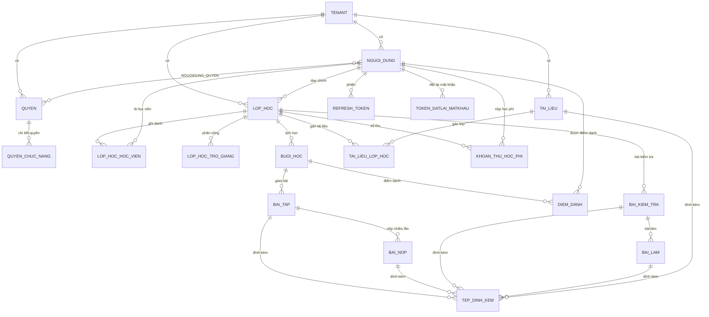

# ERD — Mô hình dữ liệu

**20 bảng**, PostgreSQL. Nội dung dưới đây khớp với schema thật (kiểm bằng
`information_schema` sau khi áp toàn bộ migration), không phải bản thiết kế trên giấy.

## Nguyên tắc bắt buộc

> Mọi bảng nghiệp vụ có cột `tenant_id` (FK → `TENANT`) và **bắt buộc** áp dụng EF Core Global
> Query Filter theo `tenant_id` đang đăng nhập. Không được quên ở bất kỳ entity mới nào.
> Cách triển khai: [../backend/multi-tenant.md](../backend/multi-tenant.md).

Áp dụng cho **cả bảng chi tiết** — xem
[Denormalize tenant_id xuống bảng con](#denormalize-tenant_id-xuống-bảng-con).

## Quy ước đặt tên

| Đối tượng | Quy ước | Ví dụ |
|---|---|---|
| Bảng | `UPPER_SNAKE_CASE`, số ít | `LOP_HOC`, `KHOAN_THU_HOC_PHI` |
| Cột | `lower_snake_case` | `giao_vien_chinh_id`, `hoc_phi_ap_dung` |
| Khoá chính | `id` (`uuid`) | |
| Khoá ngoại | `<bảng>_id` | `lop_hoc_id` |
| Index | `ix_<bảng>_<cột>` | `ix_buoi_hoc_lop_hoc_id_thu_tu` |

Sinh tự động bởi `UseSnakeCaseNamingConvention` — xem
[quy-uoc-migration.md](./quy-uoc-migration.md).

## Sơ đồ tổng quan

## Chi tiết bảng

### Nhóm nền tảng (7 bảng — kế thừa từ base)

| Bảng | Vai trò | Ghi chú |
|---|---|---|
| `TENANT` | Trung tâm | `ma_trung_tam` 7 ký tự, duy nhất **toàn hệ thống**. `mui_gio` (mặc định `Asia/Ho_Chi_Minh`), `so_ngay_canh_bao_no_hoc_phi` (mặc định 14) |
| `NGUOI_DUNG` | Tài khoản | `ho_ten` bắt buộc, `loai_nguoi_dung` **chỉ để lọc danh sách**, không dùng phân quyền |
| `QUYEN` | Nhóm quyền | Seeder tạo sẵn 4 nhóm: Quản trị viên / Giáo viên / Trợ giảng / Học viên |
| `QUYEN_CHUC_NANG` | Chi tiết quyền | `(quyen_id, ten_chuc_nang, hanh_dong)` — nguồn của phân quyền động |
| `NGUOIDUNG_QUYEN` | Gán nhóm quyền | Nhiều–nhiều |
| `REFRESH_TOKEN` | Phiên đăng nhập | Xoay vòng, phát hiện tái sử dụng |
| `TOKEN_DATLAI_MATKHAU` | Quên mật khẩu | Hash, hạn 30 phút, dùng một lần |

### Nhóm lớp học (3 bảng)

| Bảng | Cột đáng chú ý |
|---|---|
| `LOP_HOC` | `giao_vien_chinh_id` NOT NULL (đúng 1 người), `hoc_phi` nullable (`null` = chưa nhập ≠ `0` = miễn phí), `suc_chua_toi_da` nullable = không giới hạn, `nhan_ban_tu_lop_id` (dấu vết nguồn gốc), `trang_thai` |
| `LOP_HOC_HOC_VIEN` | `ngay_vao_lop`, `ngay_roi_lop`, `trang_thai`, **`hoc_phi_ap_dung`** — snapshot lúc ghi danh, cho phép miễn giảm từng người |
| `LOP_HOC_TRO_GIANG` | Bảng **riêng**, không gộp với học viên bằng cột `vai_tro`: gộp thì nửa số cột luôn NULL và mọi query học viên phải nhớ `WHERE vai_tro = 1` |

### Nhóm buổi học & điểm danh (2 bảng)

| Bảng | Cột đáng chú ý |
|---|---|
| `BUOI_HOC` | `bat_dau`, `ket_thuc` là `timestamptz` — **không có cột `ngay_hoc`**: cột ngày tách rời sẽ lệch khi trung tâm đổi múi giờ. `giao_vien_id` nullable = dùng giáo viên của lớp. `la_hoc_bu` |
| `DIEM_DANH` | **Hai cột trạng thái**: `trang_thai_tu_khai` (nullable — học viên tự khai; null ≠ Vắng) và `trang_thai_chinh_thuc` (NOT NULL — **nguồn sự thật duy nhất cho mọi báo cáo**). Gộp một cột là mất vĩnh viễn thông tin học viên đã khai gì trước khi giáo viên ghi đè |

### Nhóm học liệu (6 bảng)

| Bảng | Cột đáng chú ý |
|---|---|
| `BAI_TAP` | Gắn vào `buoi_hoc_id` |
| `BAI_NOP` | **`lan_nop`** — nộp nhiều lần, giữ lịch sử; bài mới nhất là `MAX(lan_nop)` |
| `BAI_KIEM_TRA` | Gắn vào `lop_hoc_id`. `loai` giữ sẵn `TracNghiemOnline` cho tương lai, hiện chỉ nộp file |
| `BAI_LAM` | `han_nop_rieng` nullable = gia hạn riêng; hạn hiệu lực = `han_nop_rieng ?? bai_kiem_tra.dong_luc` |
| `TAI_LIEU` + `TAI_LIEU_LOP_HOC` | **Không có hàng nào** trong bảng gán = tài liệu chung toàn trung tâm |
| `TEP_DINH_KEM` | Một bảng dùng chung, **5 cột FK nullable loại trừ nhau**, ép bằng `CHECK` |

### Nhóm học phí (1 bảng)

| Bảng | Cột đáng chú ý |
|---|---|
| `KHOAN_THU_HOC_PHI` | `so_tien numeric(18,2)` + `CHECK (so_tien > 0)`, `phuong_thuc`, `so_phieu` (đối chiếu phiếu giấy), `nguoi_thu_id`. **Không có cột `da_thu` ở đâu cả** — công nợ tính động bằng `SUM` |

## Ràng buộc nghiệp vụ quan trọng

| Ràng buộc | Bảng | Lý do |
|---|---|---|
| `UNIQUE(ma_trung_tam)` | `TENANT` | Mã 7 ký tự sinh tự động, duy nhất **toàn hệ thống** — xem [FR-01](../nghiep-vu/dang-nhap.md#mã-đội) |
| `UNIQUE(tenant_id, username)` | `NGUOI_DUNG` | Username duy nhất **trong phạm vi trung tâm**; hai trung tâm đều có thể có `admin` |
| `UNIQUE(tenant_id, ten) WHERE trang_thai <> 0` | `LOP_HOC` | Tên lớp duy nhất trong trung tâm, **nhưng lớp nháp không chiếm tên** — nháp bỏ ngang không được chặn người khác ba tháng sau |
| `UNIQUE(lop_hoc_id, hoc_vien_id)` | `LOP_HOC_HOC_VIEN` | Ghi danh một lần |
| `UNIQUE(lop_hoc_id, tro_giang_id)` | `LOP_HOC_TRO_GIANG` | Phân công một lần |
| `UNIQUE(lop_hoc_id, thu_tu)` | `BUOI_HOC` | Số thứ tự buổi không trùng trong lớp |
| `UNIQUE(buoi_hoc_id, hoc_vien_id)` | `DIEM_DANH` | Mỗi học viên một dòng điểm danh/buổi — chặn ở **tầng DB**, không chỉ ở UI |
| `UNIQUE(bai_tap_id, hoc_vien_id, lan_nop)` | `BAI_NOP` | Nộp nhiều lần nhưng không trùng số lần |
| `UNIQUE(bai_kiem_tra_id, hoc_vien_id)` | `BAI_LAM` | Bài kiểm tra làm một lần (khác bài tập) |
| `UNIQUE(tai_lieu_id, lop_hoc_id)` | `TAI_LIEU_LOP_HOC` | Gán một lần |
| `CHECK` đúng một FK khác null | `TEP_DINH_KEM` | `ck_tep_dinh_kem_dung_mot_chu` — không dựa vào validate ở handler |
| `CHECK (so_tien > 0)` | `KHOAN_THU_HOC_PHI` | `ck_khoan_thu_so_tien_duong`. Số âm làm mọi báo cáo tổng thu sai mà không ai nhìn ra |

Các UNIQUE trên bảng con **không kèm `tenant_id`**: cột đầu đã là FK về bảng đã mang tenant.

## Hành vi xoá — Restrict ở đâu và vì sao

| Quan hệ | Delete | Lý do |
|---|---|---|
| `LOP_HOC → NGUOI_DUNG` (giáo viên chính) | Restrict | Xoá giáo viên đang dạy phải bị chặn, buộc bàn giao lớp trước |
| `BUOI_HOC → LOP_HOC` | Restrict | Cascade sẽ cuốn sạch lịch sử chuyên cần khi xoá lớp |
| `DIEM_DANH → BUOI_HOC` | Restrict | Điểm danh là bằng chứng |
| `KHOAN_THU_HOC_PHI → NGUOI_DUNG` / `→ LOP_HOC` | Restrict | Dữ liệu tiền không được biến mất theo tài khoản hay theo lớp |
| `DIEM_DANH → NGUOI_DUNG` (người xác nhận) | SetNull | Chỉ là dấu vết; Restrict sẽ khoá cứng mọi tài khoản giáo viên vĩnh viễn |
| `KHOAN_THU_HOC_PHI → NGUOI_DUNG` (người thu) | SetNull | Cùng lý do |
| `LOP_HOC → LOP_HOC` (nhân bản từ) | SetNull | Chỉ là dấu vết nguồn gốc; bản sao là lớp thật đang chạy |
| `TEP_DINH_KEM → *` | Cascade | Tệp đi theo nội dung chứa nó |

Vì Restrict chồng Restrict, UI đưa **"Huỷ lớp"** làm hành động mặc định; xoá cứng chỉ cho lớp
nháp chưa có buổi học.

## Denormalize tenant_id xuống bảng con

Mọi bảng chi tiết (`QUYEN_CHUC_NANG`, `NGUOIDUNG_QUYEN`, `LOP_HOC_HOC_VIEN`,
`LOP_HOC_TRO_GIANG`, `BUOI_HOC`, `DIEM_DANH`, `BAI_TAP`, `BAI_NOP`, `BAI_LAM`,
`TAI_LIEU_LOP_HOC`, `TEP_DINH_KEM`, `KHOAN_THU_HOC_PHI`) **mang cột `tenant_id` riêng** thay vì
chỉ kế thừa phạm vi qua bảng cha.

**Vì sao:** Global Query Filter chỉ áp cho entity có `TenantId`. Nếu bảng con không có, mọi truy
vấn trực tiếp — đếm buổi vắng, cộng dồn học phí, kiểm tra quyền — đều phải nhớ join lên bảng cha.
Quên một lần là rò rỉ dữ liệu chéo trung tâm, đúng lỗi nghiêm trọng nhất hệ thống này có thể mắc.

**Đánh đổi đã chấp nhận:** thừa một cột `uuid` mỗi bảng, và cần giữ `tenant_id` của bản ghi con
nhất quán với cha. Việc gán đã tự động hoá trong `AppDbContext.SaveChanges` nên tầng Application
không phải nhớ; `CachLyTenantTests` canh mọi bảng đều có cột và có filter.

## Chỗ ERD không bảo vệ được

**Kho tệp MinIO không có Query Filter.** Cách ly tenant ở đó dựa hoàn toàn vào quy ước khoá
`{tenantId}/{loai}/{guid}{ext}` và việc `TaiVe`/`Xoa` kiểm lại tiền tố. Xem
[multi-tenant.md](../backend/multi-tenant.md).

## Tham chiếu

- Nghiệp vụ dùng các bảng này: [../nghiep-vu/](../nghiep-vu/README.md)
- Cách áp Global Query Filter: [../backend/multi-tenant.md](../backend/multi-tenant.md)
- Quy ước migration: [quy-uoc-migration.md](./quy-uoc-migration.md)
