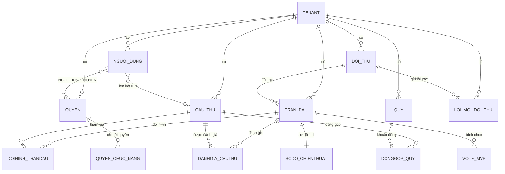

# ERD — Mô hình dữ liệu

## Nguyên tắc bắt buộc

> Mọi bảng nghiệp vụ có cột `tenant_id` (FK → `TENANT`) và **bắt buộc** áp dụng EF Core Global Query
> Filter theo `tenant_id` đang đăng nhập. Không được quên ở bất kỳ entity mới nào.
> Cách triển khai: [../backend/multi-tenant.md](../backend/multi-tenant.md).

Áp dụng cho **cả bảng chi tiết** (`DOIHINH_TRANDAU`, `SODO_CHIENTHUAT`, `DANHGIA_CAUTHU`, `VOTE_MVP`,
`QUYEN_CHUC_NANG`, `NGUOIDUNG_QUYEN`, `DONGGOP_QUY`) — xem
[Denormalize tenant_id xuống bảng con](#denormalize-tenant_id-xuống-bảng-con).

## Sơ đồ tổng quan

## Chi tiết bảng

### Nhóm nền tảng

| Bảng | Mục đích | Trường chính | Quan hệ |
|---|---|---|---|
| `TENANT` | CLB | id, ten_doi, ten_viet_tat, ngay_thanh_lap, logo_url, anh_bia_url, mo_ta | 1—N với hầu hết bảng khác qua `tenant_id` |
| `NGUOI_DUNG` | Tài khoản đăng nhập | id, tenant_id, username, password_hash, email, so_dien_thoai, dia_chi, phai_doi_mk, cau_thu_id (FK nullable), trang_thai | N—1 TENANT; 0..1 với CAU_THU; N—N với QUYEN qua `NGUOIDUNG_QUYEN` |
| `CAU_THU` | Hồ sơ cầu thủ | id, tenant_id, anh_dai_dien, ho_ten, ngay_sinh, ngay_tham_gia, ghi_chu | Độc lập với NGUOI_DUNG |

### Nhóm phân quyền

| Bảng | Mục đích | Trường chính | Quan hệ |
|---|---|---|---|
| `QUYEN` | Nhóm quyền | id, tenant_id, ten_quyen | 1—N với `QUYEN_CHUC_NANG` |
| `QUYEN_CHUC_NANG` | Chi tiết quyền | id, quyen_id, ten_chuc_nang, hanh_dong (xem/them/sua/xoa) | N—1 QUYEN |
| `NGUOIDUNG_QUYEN` | Bảng trung gian | nguoi_dung_id, quyen_id | N—N |

### Nhóm trận đấu

| Bảng | Mục đích | Trường chính | Quan hệ |
|---|---|---|---|
| `DOI_THU` | Đối thủ | id, tenant_id, ten_doi, lien_he | 1—N TRAN_DAU, 1—N LOI_MOI_DOI_THU |
| `LOI_MOI_DOI_THU` | Lời mời giao hữu | id, tenant_id, doi_thu_id, thoi_gian_de_xuat, trang_thai | N—1 DOI_THU |
| `TRAN_DAU` | Trận đấu | id, tenant_id, thoi_gian, doi_thu_id, ty_so_nha, ty_so_khach, ket_qua, link_video, nhan_xet_chung, trang_thai | 1—N DOIHINH_TRANDAU, 1—1 SODO_CHIENTHUAT, 1—N DANHGIA_CAUTHU, 1—N VOTE_MVP |
| `DOIHINH_TRANDAU` | Đội hình tham gia | id, tran_dau_id, cau_thu_id, vi_tri | N—1 TRAN_DAU, N—1 CAU_THU |
| `SODO_CHIENTHUAT` | Sơ đồ chiến thuật | id, tran_dau_id (1—1), so_do_json, ghi_chu_chien_thuat | 1—1 TRAN_DAU |
| `DANHGIA_CAUTHU` | Đánh giá sau trận | id, tran_dau_id, cau_thu_id, so_ban_ghi_duoc, so_ban_cuu_thua, chi_so_ky_nang (JSON), ghi_chu | N—1 TRAN_DAU, N—1 CAU_THU |
| `VOTE_MVP` | Bình chọn MVP | id, tran_dau_id, nguoi_vote_id, nguoi_duoc_vote_id, **UNIQUE(tran_dau_id, nguoi_vote_id)** | N—1 TRAN_DAU |

### Nhóm tài chính

| Bảng | Mục đích | Trường chính | Quan hệ |
|---|---|---|---|
| `QUY` | Đợt quỹ | id, tenant_id, ten_quy, thoi_han, ghi_chu, trang_thai | 1—N DONGGOP_QUY |
| `DONGGOP_QUY` | Đóng góp quỹ | id, quy_id, cau_thu_id, so_tien_can_dong, so_tien_da_dong, ngay_dong | N—1 QUY, N—1 CAU_THU |

## Ràng buộc nghiệp vụ quan trọng

| Ràng buộc | Bảng | Lý do |
|---|---|---|
| `UNIQUE(tran_dau_id, nguoi_vote_id)` | `VOTE_MVP` | Mỗi người tối đa 1 tim/trận (FR-10) — quy tắc bất di bất dịch #7 |
| `UNIQUE(tenant_id, username)` | `NGUOI_DUNG` | Username duy nhất **trong phạm vi tenant**, hai CLB có thể cùng có `admin` |
| `UNIQUE(tran_dau_id)` | `SODO_CHIENTHUAT` | Quan hệ 1—1 với trận đấu |
| `UNIQUE(quy_id, cau_thu_id)` | `DONGGOP_QUY` | Một cầu thủ chỉ có 1 khoản đóng trong mỗi đợt quỹ |
| `cau_thu_id` nullable | `NGUOI_DUNG` | Tài khoản có thể không gắn hồ sơ cầu thủ nào (0..1) |
| `so_tien_da_dong <= so_tien_can_dong` | `DONGGOP_QUY` | Kiểm tra ở tầng Application (FluentValidation) |

## Denormalize tenant_id xuống bảng con

Bảy bảng chi tiết (`QUYEN_CHUC_NANG`, `NGUOIDUNG_QUYEN`, `DOIHINH_TRANDAU`, `SODO_CHIENTHUAT`,
`DANHGIA_CAUTHU`, `VOTE_MVP`, `DONGGOP_QUY`) **mang cột `tenant_id` riêng** thay vì chỉ kế thừa phạm vi
qua bảng cha.

**Vì sao:** Global Query Filter chỉ áp cho entity có `TenantId`. Nếu bảng con không có, mọi truy vấn
trực tiếp — đếm phiếu MVP, tổng đóng quỹ, kiểm tra quyền — đều phải nhớ join lên bảng cha. Quên một lần
là rò rỉ dữ liệu chéo CLB, đúng lỗi nghiêm trọng nhất hệ thống này có thể mắc.

**Đánh đổi đã chấp nhận:** thừa một cột `uuid` mỗi bảng, và cần giữ `tenant_id` của bản ghi con nhất
quán với cha. Việc gán đã tự động hóa trong `AppDbContext.SaveChanges` nên tầng Application không phải
nhớ; `CachLyTenantTests` canh cả 7 bảng đều có cột và có filter.

## Tham chiếu

- Nghiệp vụ dùng các bảng này: [../nghiep-vu/](../nghiep-vu/README.md)
- Cách áp Global Query Filter: [../backend/multi-tenant.md](../backend/multi-tenant.md)
