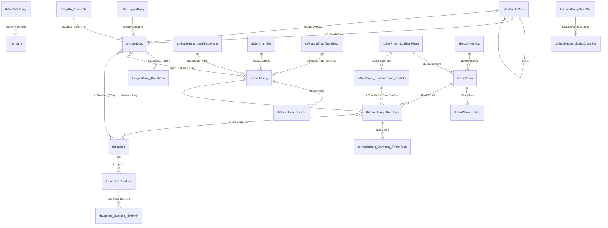

# Mô tả CSDL nguồn – hệ thống CRM / Doanh thu / Lớp học (VIETGEN)

> Tài liệu dùng cho việc migrate sang dự án mới. Bản export **không kèm DDL/FK constraint**, nên mọi quan hệ dưới đây được **suy ra từ dữ liệu thực** (đối chiếu giá trị GUID giữa các bảng) – tỉ lệ khớp ghi kèm để đánh giá độ tin cậy.
> Nguồn: 31 file JSON (`tbXxx.json`), export ngày 01/10/2026. Kiểu DB gốc: SQL Server (GUID viết hoa, datetime `yyyy-MM-dd HH:mm:ss.fff`).

---

## 1. Tổng quan

| Nhóm | Bảng | Số dòng |
|---|---|---|
| **Hệ thống / Tenant** | tbDonViSuDung | 2 |
| | tbDonViSuDung_DonViLienKet | 0 |
| **Tổ chức & người dùng** | tbCoCauToChuc | 16 |
| | tbKieuNguoiDung | 15 |
| | tbNguoiDung | 185 |
| **Doanh thu / KPI** | tbCapDo_DoanhThu | 12 |
| | tbNguoiDung_DoanhThu | 336 |
| | tbCoCauToChuc_DoanhThu | 30 |
| **Danh mục** | tbDonViTien | 6 |
| | tbPhuongThucThanhToan | 9 |
| | tbGoiChamSoc | 3 |
| | tbKhachHang_LoaiKhachHang | 6 |
| | tbLoaiKhoaHoc | 2 |
| | tbSanPham_LoaiSanPham | 2 |
| | tbSanPham_LoaiSanPham_TrinhDo | 50 |
| **Sản phẩm** | tbSanPham | 40 |
| | tbSanPham_LichSu | 48 |
| **Khách hàng (CRM)** | tbKhachHang | 981 |
| | tbKhachHang_LichSu | 1.486 |
| | tbKhachHang_DonHang | 1.077 |
| | tbKhachHang_DonHang_ThanhToan | 1.174 |
| **Chăm sóc KH (module mới)** | tbKhachHangChamSoc | 7 |
| | tbKhachHang_LichSuChamSoc | 18 |
| **Lớp học (LMS)** | tbLopHoc | 136 |
| | tbLopHoc_BuoiHoc | 2.654 |
| | tbLopHoc_BuoiHoc_HinhAnh | 278 |
| **Bảng rỗng** | tbCongThucTinhLuong_GiaoVien, tbKhachHang_TrangThaiHoc, tbKhachHang_DonHang_TrangThaiHoc, tbLopHoc_TrangThaiHoc | 0 |

### Quy ước chung (áp dụng cho hầu hết bảng)

| Cột | Ý nghĩa | Ghi chú migrate |
|---|---|---|
| `Stt` | Số thứ tự (int, có vẻ IDENTITY) | **Không phải khóa**. Ở `tbCoCauToChuc_DoanhThu` toàn bộ = 0. Không dùng làm PK. |
| `Id<TênBảng>` (cột thứ 2) | **PK** – GUID | Giữ nguyên GUID để không phải remap FK. |
| `TrangThai` | 1 = hoạt động, 0 = **xóa mềm** | Riêng `tbKhachHang.TrangThai` mang nghĩa giai đoạn (xem §4). |
| `MaDonViSuDung` | FK → `tbDonViSuDung` (multi-tenant) | 2 tenant: `F4B89D3A…` = **VIETGEN Academy (production)**, `6A18E7F7…` = **VIETGEN – LOCALHOST (test)**. |
| `NgayTao`, `IdNguoiTao` | Audit tạo | `IdNguoiTao` → `tbNguoiDung.IdNguoiDung` (khớp 100%). |
| `NgaySua`, `IdNguoiSua` | Audit sửa | `IdNguoiSua` → `tbNguoiDung.IdNguoiDung`. |
| `GhiChu` | Ghi chú tự do | |

**GUID "rỗng"** `00000000-0000-0000-0000-000000000000` được dùng thay cho NULL ở nhiều cột FK (IdCha, IdLoaiKhachHang, IdCapDo_DoanhThu, IdCoCauToChuc…). **Khi migrate phải chuyển thành NULL**, nếu không sẽ vỡ FK constraint.

**Cột đa trị dạng chuỗi**: một số cột lưu nhiều GUID trong 1 chuỗi, định dạng `",guid1,guid2"` (dấu phẩy đứng đầu, GUID **chữ thường**). Đây là quan hệ N-N bị "nhét" vào cột – nên tách thành bảng nối ở dự án mới. Danh sách: `tbKhachHang.QuyenTruyCap`, `tbCoCauToChuc.IdQuanLy`, `tbLopHoc.IdGiaoVien/IdKhachHang/IdDonHang`, `tbLopHoc_BuoiHoc.IdGiaoVien/IdKhachHang/IdDonHang`.

**So sánh GUID phải không phân biệt hoa/thường** (cột đơn viết HOA, cột đa trị viết thường).

---

## 2. Sơ đồ quan hệ (ERD)



Luồng nghiệp vụ chính:

```
Khách hàng ──► Đơn hàng (mua 1 Sản phẩm/khóa) ──► Thanh toán (1..n đợt)
                    │
                    └──► Lớp học (1-1 là chủ yếu) ──► Buổi học ──► Hình ảnh buổi học
Người dùng (Sale) ──► tạo Thanh toán ──► tổng hợp thành Doanh thu tháng (KPI) ──► Cấp độ doanh thu
```

---

## 3. Bảng quan hệ khóa ngoại (đã kiểm chứng trên dữ liệu)

| Bảng con . Cột | → Bảng cha . Cột | Loại | Khớp | Ghi chú |
|---|---|---|---|---|
| tbCoCauToChuc.IdCha | tbCoCauToChuc.IdCoCauToChuc | N-1 (cây) | 10/16 | 6 dòng gốc dùng GUID rỗng |
| tbCoCauToChuc.IdQuanLy | tbNguoiDung.IdNguoiDung | N-N (CSV) | 10/10 | 1–2 quản lý/đơn vị |
| tbNguoiDung.IdCoCauToChuc | tbCoCauToChuc | N-1 | 11/11 | |
| tbNguoiDung.IdKieuNguoiDung | tbKieuNguoiDung | N-1 | 13/13 | = vai trò (role) |
| tbNguoiDung.IdCapDo_DoanhThu | tbCapDo_DoanhThu | N-1, nullable | 7/8 | 45 dòng GUID rỗng, 122 NULL |
| tbNguoiDung.IdChucVu | **tbChucVu (KHÔNG có trong export)** | N-1 | – | 6 giá trị. Cần export thêm |
| tbNguoiDung_DoanhThu.IdNguoiTao | tbNguoiDung | N-1 (**ngầm**) | 60/60 | **Không có cột IdNguoiDung** – xem §5 |
| tbCoCauToChuc_DoanhThu.IdCoCauToChuc | tbCoCauToChuc | N-1 | 0/30 | **Toàn bộ = GUID rỗng** → thực tế là KPI cấp tenant |
| tbKhachHang.IdLoaiKhachHang | tbKhachHang_LoaiKhachHang | N-1 | 955/981 | 26 dòng GUID rỗng |
| tbKhachHang.IdGoiChamSoc | tbGoiChamSoc | N-1 | 100% | |
| tbKhachHang.IdPhuongThucThanhToan | tbPhuongThucThanhToan | N-1 | 100% | |
| tbKhachHang.IdQuocGiaSinhSong | **tbQuocGia (KHÔNG có trong export)** | N-1 | – | 5 giá trị. Cần export thêm |
| tbKhachHang.QuyenTruyCap | tbNguoiDung | N-N (CSV) | 60/60 | DS user được xem KH; luôn chứa người tạo |
| tbKhachHang_LichSu.IdKhachHang | tbKhachHang | N-1 | 981/989 | **8 KH đã bị xóa cứng** → lịch sử mồ côi |
| tbKhachHang_DonHang.IdKhachHang | tbKhachHang | N-1 | 100% | 869 KH có 1 đơn, 97 KH có 2–4 đơn |
| tbKhachHang_DonHang.IdSanPham | tbSanPham | N-1 | 100% | |
| tbKhachHang_DonHang.IdTrinhDoDauVao | tbSanPham_LoaiSanPham_TrinhDo (LoaiTrinhDo='dauvao') | N-1 | 100% | |
| tbKhachHang_DonHang.IdTrinhDoDauRa | tbSanPham_LoaiSanPham_TrinhDo (LoaiTrinhDo='daura') | N-1 | 100% | |
| tbKhachHang_DonHang_ThanhToan.IdDonHang | tbKhachHang_DonHang | N-1 | 100% | Mọi đơn đều có ≥1 thanh toán |
| tbKhachHang_DonHang_ThanhToan.IdKhachHang | tbKhachHang | N-1 (dư thừa) | 100% | Luôn = DonHang.IdKhachHang |
| tbKhachHang_DonHang_ThanhToan.IdSanPham | tbSanPham | N-1 (dư thừa) | 100% | Luôn = DonHang.IdSanPham |
| tbKhachHang_DonHang_ThanhToan.IdDonViTien | tbDonViTien | N-1 | – | **Toàn bộ NULL** – xem §5 |
| tbSanPham.IdLoaiSanPham | tbSanPham_LoaiSanPham | N-1 | 100% | Tiếng Anh / Tiếng Đức |
| tbSanPham.IdLoaiKhoaHoc | tbLoaiKhoaHoc | N-1 | 100% | Hiện chỉ "Khóa 1 kèm 1" |
| tbSanPham_LichSu.IdSanPham | tbSanPham | N-1 | 100% | |
| tbSanPham_LoaiSanPham_TrinhDo.IdLoaiSanPham | tbSanPham_LoaiSanPham | N-1 | 100% | |
| tbLopHoc.IdKhachHang | tbKhachHang | N-N (CSV) | 100% | |
| tbLopHoc.IdDonHang | tbKhachHang_DonHang | N-N (CSV) | 100% | Tập KH luôn = chủ của các đơn |
| tbLopHoc.IdGiaoVien | tbNguoiDung (role Giáo viên) | N-N (CSV) | 100% | |
| tbLopHoc_BuoiHoc.IdLopHoc | tbLopHoc | N-1 | 117/118 | **3 buổi học mồ côi** (lớp `302BF5AD…` đã xóa cứng) |
| tbLopHoc_BuoiHoc.IdGiaoVien / IdKhachHang / IdDonHang | như tbLopHoc | N-N (CSV) | 100% | Snapshot tại buổi học (GV có thể khác lớp) |
| tbLopHoc_BuoiHoc_HinhAnh.IdLopHoc_BuoiHoc | tbLopHoc_BuoiHoc | N-1 | 100% | |
| tbLopHoc_BuoiHoc_HinhAnh.IdLopHoc | tbLopHoc | N-1 (dư thừa) | 100% | Luôn khớp với buổi học |
| tbKhachHang_LichSuChamSoc.IdKhachHangChamSoc | tbKhachHangChamSoc | N-1 | 100% | |
| tbKieuNguoiDung.IdChucNang | **tbChucNang / tbThaoTac (KHÔNG có trong export)** | JSON | – | Phân quyền dạng JSON – xem §4 |
| *.MaDonViSuDung | tbDonViSuDung | N-1 | 100% | Một số danh mục để NULL (dùng chung) |
| *.IdNguoiTao / IdNguoiSua | tbNguoiDung | N-1 | 100% | |

---

## 4. Chi tiết từng bảng

### 4.1 tbDonViSuDung – Đơn vị sử dụng (tenant)
PK `MaDonViSuDung`. Cột: TenDonViSuDung, TenMien, ThietBiLuuTru (base URL lưu file), DiaChi, SoDienThoai, Email, Logo, Banner, TieuDeTrangChu, GiaoDien, SuDungTrangNguoiDung.
- `F4B89D3A-5246-4D90-83C2-2DB9C3E4D9B7` – VIETGEN Academy (thật, 970 KH / 174 user)
- `6A18E7F7-3C3B-48C2-BB5C-D8D1C3A3D5D4` – VIETGEN – LOCALHOST (test, 11 KH / 11 user) → **cân nhắc loại bỏ khi migrate**.

### 4.2 tbCoCauToChuc – Cơ cấu tổ chức (cây phòng ban)
PK `IdCoCauToChuc`. `IdCha` tự tham chiếu (GUID rỗng = gốc), `CapDo` 1 = phòng, 2 = nhóm/team. `IdQuanLy` = CSV user quản lý.
Ví dụ cây: *Phòng kinh doanh* → các team *Leader Phúc Ngân, Leader Hà Châu, …*; *Phòng sản phẩm* → *Tiếng Đức, Tiếng Anh*; *phòng giáo viên*.

### 4.3 tbKieuNguoiDung – Vai trò (role)
PK `IdKieuNguoiDung`. `TenKieuNguoiDung` (SUPER ADMIN, Tổng giám đốc, Nhân viên kinh doanh, … – master, Giáo viên, Điều phối lớp, Quản lý lớp học, Khách…). `CapDo` toàn NULL.
`IdChucNang` là **JSON** chứa toàn bộ quyền:
```json
[{"ChucNang":{"IdChucNang":"…","MaChucNang":"ChamSocKhachHang"},
  "ThaoTacs":[{"IdThaoTac":"…","MaThaoTac":"chamsockhachhang-themmoi"}, …]}]
```
→ Ở dự án mới nên tách thành `Role – Permission` (MaChucNang, MaThaoTac là mã ổn định để map).

### 4.4 tbNguoiDung – Người dùng (nhân viên, giáo viên)
PK `IdNguoiDung`. FK: IdCoCauToChuc, IdKieuNguoiDung, IdChucVu (thiếu bảng), IdCapDo_DoanhThu.
Cột chính: TenDangNhap (email công ty), MatKhau, TenNguoiDung, GioiTinh (0/1), Email, SoDienThoai, NgaySinh, SoTaiKhoanNganHang (text tự do), LinkLienHe, SoLanDangNhap, YeuCauDoiMatKhau, KichHoat, KichHoatGioiThieu, Online, ThongTinThietBi_TruyCap (JSON trình duyệt).
Phân bổ vai trò: 107 Giáo viên, 67 Sale (kể cả master), còn lại quản lý/điều phối.
⚠ `MatKhau` là **MD5 không salt** (VD `c4ca4238…` = MD5("1")) → không nên mang nguyên sang; nên ép đổi mật khẩu hoặc rehash khi user đăng nhập lần đầu.
⚠ `TenDangNhap` trùng: `khanhhuyen@…`, `nguoidung1@…`, `quanlylophoc@…` → cần xử lý nếu đặt UNIQUE.
⚠ `NgaySinh = 1900-01-01` là giá trị giả → chuyển NULL.

### 4.5 tbCapDo_DoanhThu – Cấp độ doanh thu (bậc Sale)
PK `IdCapDo_DoanhThu`. Mỗi tenant 6 cấp: Thử việc (0đ), NS-1 85tr, NS-2 200tr, NS-3 600tr, NS-4 1,2 tỷ, NS-5 2,5 tỷ (`DoanhThuYeuCau`). Được gán vào `tbNguoiDung.IdCapDo_DoanhThu`.

### 4.6 tbNguoiDung_DoanhThu – KPI doanh thu tháng của từng Sale
PK `IdNguoiDung_DoanhThu`. Cột: DoanhThuMucTieu, DoanhThuThucTe, PhanTramHoanThien (= ThucTe/MucTieu×100), NgayLenMucTieu (**chuỗi `MM/yyyy`**), NgayDatMucTieu (thời điểm đạt 100%).
→ Xem §5 về cách xác định Sale.

### 4.7 tbCoCauToChuc_DoanhThu – KPI doanh thu tháng cấp công ty
Cấu trúc giống 4.6, thêm `IdCoCauToChuc` (toàn GUID rỗng). Một dòng / tenant / tháng. `Stt` toàn 0.

### 4.8 Danh mục
| Bảng | Nội dung |
|---|---|
| tbDonViTien | MaDonViTien (vnd, usd, eur, gbp, chf, cad) + `GiaTriQuyDoiVND` (tỷ giá **cố định**: EUR 24.500, CAD 16.500, USD 23.500, GBP 30.000, CHF 26.000) |
| tbPhuongThucThanhToan | Techcombank, MB Bank, Tk Đức, Tk CAD, Tk Thụy Sỹ, Paypal, Remitly, Tiền mặt, *Chưa đóng* (dùng chung, MaDonViSuDung NULL) |
| tbGoiChamSoc | Thường, Care, Care+ |
| tbKhachHang_LoaiKhachHang | Đang tư vấn, Chờ xếp lớp – học thử, Chờ xếp lớp – học chính, Đang học, Đã học xong, Ngừng chăm sóc |
| tbLoaiKhoaHoc | Khóa 1 kèm 1, Tài liệu |
| tbSanPham_LoaiSanPham | Tiếng Anh, Tiếng Đức |
| tbSanPham_LoaiSanPham_TrinhDo | Trình độ theo ngôn ngữ; `LoaiTrinhDo` = `dauvao`/`daura`; `CapDo` = thứ tự. VD Đức đầu ra: A1, A2, B1, B2, Telc/Goethe B1/B2, DTZ; Anh đầu ra: GTLV1-4, IELTS, CLB 0-8, Life in UK, Pre Celpip, UK B1, Nails |

### 4.9 tbSanPham – Sản phẩm / khóa học
PK `IdSanPham`. FK IdLoaiSanPham, IdLoaiKhoaHoc. Cột: TenSanPham, MaSanPham (toàn NULL), GiaTien (giá trọn khóa), GiaTienTungBuoi, ThoiGianBuoiHoc (phút: 40/45/60/75/90), SoBuoi.

### 4.10 tbKhachHang – Khách hàng / học viên
PK `IdKhachHang`. FK: IdLoaiKhachHang, IdGoiChamSoc, IdQuocGiaSinhSong (thiếu bảng), IdPhuongThucThanhToan. `IdTrangThaiHoc`, `IdTrangThaiChamSoc` **toàn NULL** (chưa dùng).
Cột: TenKhachHang, Email, SoDienThoai, DoTuoi, NgheNghiep, NguonKhachHang (text tự do), DiaChi, LienKet (Facebook KH), **LienKetSale** (link/tên Sale phụ trách – text), QuyenTruyCap (CSV user), GhiChu.
`TrangThai` ở bảng này **không chỉ là xóa mềm** mà tương ứng giai đoạn (suy từ dữ liệu, cần xác nhận):

| TrangThai | Số KH | Thường đi với LoaiKhachHang |
|---|---|---|
| 0 | 20 | (đã xóa mềm) |
| 1 | 58 | Đang tư vấn |
| 2 | 194 | Chờ xếp lớp – học thử |
| 3 | 692 | Chờ xếp lớp – học chính / Đang học |
| 6 | 17 | Đã học xong |

⚠ Email trùng giữa các KH: 73 email → không đặt UNIQUE theo email nếu chưa làm sạch.

### 4.11 tbKhachHang_LichSu – Nhật ký thay đổi KH (audit log)
PK `IdLichSu`, FK IdKhachHang. `NoiDung` ∈ {Khởi tạo khách hàng, Cập nhật thông tin khách hàng, Cập nhật đơn hàng}. `ChiTiet` là JSON diff:
```json
[{"TenTruongDuLieu":"IdLoaiKhachHang","GiaTri_Cu":"88b5…","GiaTri_Moi":"4aef…"}, …]
```
`tbSanPham_LichSu` có cấu trúc y hệt cho sản phẩm.

### 4.12 tbKhachHang_DonHang – Đơn hàng (đăng ký khóa)
PK `IdDonHang`. FK IdKhachHang, IdSanPham, IdTrinhDoDauVao, IdTrinhDoDauRa. `IdTrangThaiHoc` toàn NULL.
Cột: TongSoTien (VND), ThuTuDonHang (đơn thứ mấy của KH: 1–4), TrangThaiLopHoc (NULL/1/2 – chỉ 118 đơn có giá trị, đồng bộ từ lớp), GhiChu.
- TongSoTien = SanPham.GiaTien ở 1071/1077 đơn (6 đơn giá đặc biệt).
- ⚠ 468/1077 đơn có trình độ đầu vào/ra **thuộc ngôn ngữ khác** với sản phẩm (VD SP Tiếng Đức nhưng trình độ IELTS) → dữ liệu nhập sai, cần quyết định giữ hay làm sạch.

### 4.13 tbKhachHang_DonHang_ThanhToan – Thanh toán (đợt đóng tiền)
PK `IdThanhToan`. FK IdDonHang (+ IdKhachHang, IdSanPham dư thừa). Phân bố: 992 đơn 1 đợt, 75 đơn 2 đợt, 10 đơn 3–4 đợt.
| Cột | Ý nghĩa |
|---|---|
| ThuTuThanhToan | Đợt thứ mấy (1–4) |
| SoTienDaDong_ChuaQuyDoi | Số tiền theo **ngoại tệ gốc** (NULL ở 311 dòng) |
| SoTienDaDong | Số tiền đã quy đổi **VND** – đây là cột dùng tính doanh thu |
| PhanTramDaDong | = SoTienDaDong / DonHang.TongSoTien × 100 (khớp 100%; **tính theo đợt, không cộng dồn**) |
| IdDonViTien | **Toàn NULL** |

`IdNguoiTao` của thanh toán = **Sale được ghi nhận doanh thu**.

### 4.14 tbLopHoc – Lớp học
PK `IdLopHoc`. Cột: TenLopHoc (VD `E809`, `G741 - Ôn B2…`), NenTangHoc (GG Meet / Skype / Zoom), SoBuoi, TrangThaiLopHoc (1 = đang học?, 2 = kết thúc? – cần xác nhận), GhiChu. MaLopHoc, LichHoc, IdTrangThaiHoc **toàn NULL**.
IdGiaoVien / IdKhachHang / IdDonHang là CSV: 115/136 lớp là 1 GV – 1 KH – 1 đơn (lớp 1 kèm 1); 2 lớp nhóm; **19 lớp rỗng** (không KH/đơn/GV).

### 4.15 tbLopHoc_BuoiHoc – Buổi học
PK `IdLopHoc_BuoiHoc`, FK IdLopHoc. Cột: ThuTuBuoiHoc, ThoiGianBatDau, ThoiLuong (phút), **LuongTheoBuoi** (lương GV/buổi, VND), DiemDanh (0/1/2/3 – cần xác nhận nghĩa, VD 0 chưa điểm danh, 1 có mặt, 2 vắng có phép, 3 vắng không phép), GhiChu (nhận xét buổi). IdGiaoVien/IdKhachHang/IdDonHang CSV – snapshot theo từng buổi (dùng để tính lương GV).

### 4.16 tbLopHoc_BuoiHoc_HinhAnh – Ảnh minh chứng buổi học
PK `IdHinhAnh`, FK IdLopHoc_BuoiHoc (+ IdLopHoc dư thừa). Cột: TenHinhAnh, DuongDanHinhAnh, FileBase64.
- 264 ảnh: đường dẫn `/Assets/uploads/<MaDonViSuDung>/…` → **cần copy thư mục file từ server cũ**, không có trong export.
- 14 ảnh: đường dẫn `blob:https://…` (vô giá trị, lỗi frontend) nhưng có `FileBase64` (≤1,2 MB) → phải giải mã base64 ra file khi migrate.

### 4.17 tbKhachHangChamSoc / tbKhachHang_LichSuChamSoc – Module chăm sóc KH (mới, dữ liệu test)
`tbKhachHangChamSoc` **không liên kết với tbKhachHang** (bảng KH riêng, chỉ 7 dòng, tên kiểu "Lê Minh Tùng 2", ghi chú "Ghi chú"…) → nhiều khả năng **dữ liệu thử nghiệm**.
`tbKhachHang_LichSuChamSoc`: FK IdKhachHangChamSoc, GhiChu, GhiChuQuanLy, IdTrangThaiChamSoc (int enum 0–7, không có bảng danh mục).

---

## 5. Quan hệ ngầm & logic nghiệp vụ cần lưu ý

1. **KPI Sale không có FK tới người dùng.** `tbNguoiDung_DoanhThu` không có `IdNguoiDung`; người sở hữu KPI chính là `IdNguoiTao` (100% là role Nhân viên kinh doanh). Kiểm chứng: `DoanhThuThucTe` = tổng `ThanhToan.SoTienDaDong` (TrangThai=1) do user đó tạo trong tháng `NgayLenMucTieu` ở **293/320** dòng; phần lệch là do số liệu được chốt/sửa tay. Có 12 cặp (user, tháng) bị trùng dòng.
   → Dự án mới: thêm cột `NguoiDungId` rõ ràng = `IdNguoiTao` cũ; chuyển `NgayLenMucTieu` sang (Năm, Tháng) hoặc `date` ngày 01.
2. **KPI công ty** (`tbCoCauToChuc_DoanhThu`) là theo tenant/tháng, không theo phòng ban (IdCoCauToChuc rỗng). DoanhThuThucTe là số chốt, không luôn bằng tổng thanh toán.
3. **Doanh thu là dữ liệu tổng hợp (snapshot)**, không phải tính động → có thể migrate nguyên số hoặc tính lại từ thanh toán (sẽ lệch ~9% dòng).
4. **Tiền tệ**: `IdDonViTien` NULL toàn bộ; loại tiền chỉ suy được qua tỷ lệ `SoTienDaDong / SoTienDaDong_ChuaQuyDoi` khớp tỷ giá `tbDonViTien`: VND 632, EUR 152, CAD 37, USD 6, CHF 6, không xác định 341. Gợi ý: khi migrate, điền `IdDonViTien` theo tỷ lệ này.
5. **Lớp học ↔ Đơn hàng ↔ KH** là N-N qua CSV. Thực tế gần như 1-1. Nên tạo bảng nối `LopHoc_HocVien(LopHocId, KhachHangId, DonHangId)` và `LopHoc_GiaoVien(LopHocId, NguoiDungId)`; tương tự cho buổi học (`BuoiHoc_GiaoVien`, `BuoiHoc_HocVien` – giữ điểm danh theo học viên nếu cần).
6. **Phân quyền xem KH** (`QuyenTruyCap`) là CSV user (1–3 người, luôn gồm người tạo) → bảng nối `KhachHang_NguoiDung(KhachHangId, NguoiDungId)`.
7. **Lương giáo viên** = Σ `LuongTheoBuoi` theo GV trên `tbLopHoc_BuoiHoc` (bảng công thức lương rỗng).
8. **Dữ liệu dư thừa (denormalized)**: `ThanhToan.IdKhachHang/IdSanPham`, `HinhAnh.IdLopHoc`, `DonHang.TrangThaiLopHoc` – có thể bỏ ở mô hình mới vì suy được qua FK.

---

## 6. Checklist làm sạch khi migrate

| # | Vấn đề | Số lượng | Xử lý đề xuất |
|---|---|---|---|
| 1 | GUID rỗng ở cột FK | nhiều bảng | → NULL |
| 2 | Tenant test LOCALHOST | 11 user, 11 KH, … | Loại bỏ hoặc đánh dấu |
| 3 | KhachHang_LichSu mồ côi | 8 KH | Bỏ hoặc giữ không FK |
| 4 | BuoiHoc mồ côi | 3 buổi (lớp 302BF5AD) | Bỏ |
| 5 | Bảng tham chiếu thiếu: tbChucVu, tbQuocGia, tbChucNang/tbThaoTac | 6 + 5 + ? GUID | **Export bổ sung từ DB gốc** |
| 6 | Trình độ lệch ngôn ngữ với SP | 468 đơn | Quyết định nghiệp vụ |
| 7 | Mật khẩu MD5 | 185 | Rehash / bắt đổi |
| 8 | TenDangNhap trùng | 3 | Gộp / đổi |
| 9 | Email KH trùng | 73 | Không UNIQUE hoặc gộp KH |
| 10 | Ảnh `blob:` | 14 | Giải mã FileBase64 |
| 11 | Ảnh `/Assets/uploads` | 264 | Copy file từ server cũ |
| 12 | NgaySinh 1900-01-01 | vài user | → NULL |
| 13 | Lỗi mã hóa ký tự (VD "Lê Minh Ti?n" ở SoTaiKhoanNganHang) | ít | Sửa tay |
| 14 | Bản ghi xóa mềm (TrangThai=0) | KH 20, Đơn 17, TT 22, Buổi 67… | Quyết định có mang sang |
| 15 | Cột luôn NULL (IdTrangThaiHoc, MaLopHoc, LichHoc, MaSanPham, IdDonViTien…) và 4 bảng rỗng | – | Bỏ |
| 16 | Dữ liệu test module Chăm sóc KH | 7 + 18 | Xác nhận trước khi migrate |
| 17 | NgayLenMucTieu dạng chuỗi `MM/yyyy` | 366 | Đổi sang date / (year, month) |

## 7. Thứ tự import gợi ý (theo phụ thuộc)

1. tbDonViSuDung
2. Danh mục: tbDonViTien, tbPhuongThucThanhToan, tbGoiChamSoc, tbKhachHang_LoaiKhachHang, tbLoaiKhoaHoc, tbSanPham_LoaiSanPham, tbSanPham_LoaiSanPham_TrinhDo, tbCapDo_DoanhThu, (+ ChucVu, QuocGia nếu export bổ sung)
3. tbKieuNguoiDung → tbCoCauToChuc (cha trước con) → tbNguoiDung → tách IdQuanLy
4. tbSanPham → tbSanPham_LichSu
5. tbKhachHang → tách QuyenTruyCap → tbKhachHang_LichSu
6. tbKhachHang_DonHang → tbKhachHang_DonHang_ThanhToan
7. tbLopHoc (+ bảng nối) → tbLopHoc_BuoiHoc (+ bảng nối) → tbLopHoc_BuoiHoc_HinhAnh (+ file)
8. tbNguoiDung_DoanhThu, tbCoCauToChuc_DoanhThu
9. tbKhachHangChamSoc → tbKhachHang_LichSuChamSoc (nếu giữ)

> Lưu ý: cột audit `IdNguoiTao/IdNguoiSua` tham chiếu tbNguoiDung nhưng tbNguoiDung lại tự có audit tham chiếu chính nó → import tbNguoiDung với FK audit tắt (hoặc cập nhật sau).
